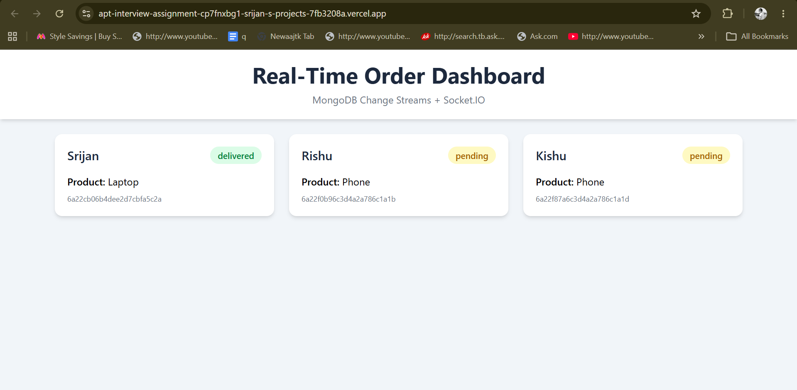
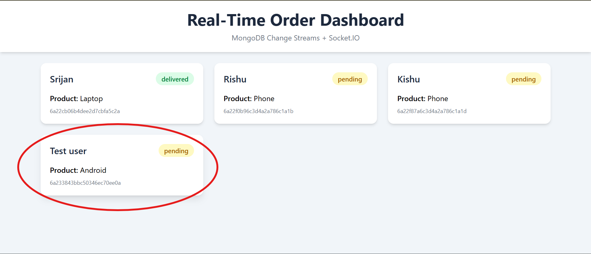

# Real-Time Order Update System

## Live Demo

**Frontend (Vercel):**
https://your-vercel-url.vercel.app

**Backend (Render):**
https://apt-interview-assignment-dujd.onrender.com

---

# Overview

This project implements a real-time order update system where connected clients automatically receive updates whenever data in the database changes.

The system avoids frequent polling by using MongoDB Change Streams and Socket.IO to push updates to connected clients in real time.

---

# Problem Statement

Design and implement a system where clients automatically receive updates whenever data in the database changes. The system should efficiently propagate updates without relying on frequent polling from clients.

---

# Tech Stack

## Backend

* Node.js
* Express.js
* MongoDB Atlas
* Mongoose
* Socket.IO

## Frontend

* React.js
* Vite
* Axios
* Socket.IO Client
* Tailwind CSS

## Deployment

* Render (Backend)
* Vercel (Frontend)
* MongoDB Atlas (Database)

---

# Architecture

```text
MongoDB Atlas
      │
      │ Change Streams
      ▼
Render
(Node.js + Express + Socket.IO)
      │
      │ Real-Time Events
      ▼
Vercel
(React Frontend)
```

---

# How It Works

1. Orders are stored in MongoDB Atlas.
2. MongoDB Change Streams monitor the Orders collection for database changes.
3. Whenever an order is created, updated, or deleted, MongoDB emits a change event.
4. The backend listens for these events and broadcasts them using Socket.IO.
5. Connected React clients instantly receive the notification.
6. The frontend automatically refreshes the latest order data and updates the UI.
7. No polling is used.

---

# Features

* Create Orders
* Update Orders
* Delete Orders
* Real-Time Notifications
* Dynamic UI Updates
* Data Persistence After Refresh
* No Polling
* MongoDB Change Streams
* Socket.IO Integration
* Responsive Dashboard
* MVC Architecture

---

# Project Structure

```text
ATP
│
├── backend
│   │
│   ├── controllers
│   │   └── Order.controller.js
│   │
│   ├── models
│   │   └── Order.js
│   │
│   ├── routes
│   │   └── Order.routes.js
│   │
│   ├── server.js
│   └── package.json
│
├── frontend
│   │
│   ├── src
│   │   ├── App.jsx
│   │   └── main.jsx
│   │
│   └── package.json
│
└── README.md
```

---

# API Endpoints

## Create Order

POST `/api/orders/create`

Request Body

```json
{
  "customer_name": "Srijan",
  "product_name": "Laptop",
  "status": "pending"
}
```

---

## Get Orders

GET `/api/orders/get`

---

## Update Order

PUT `/api/orders/update/:id`

Request Body

```json
{
  "status": "shipped"
}
```

---

## Delete Order

DELETE `/api/orders/delete/:id`

---

# Installation

## Clone Repository

```bash
git clone <repository-url>
cd ATP
```

---

## Backend Setup

```bash
cd backend
npm install
```

Create `.env`

```env
PORT=5000
MONGO_URI=your_mongodb_atlas_connection_string
```

Run Backend

```bash
npm run dev
```

---

## Frontend Setup

```bash
cd frontend
npm install
npm run dev
```

---

# Real-Time Communication Flow

```text
User Action
(Create / Update / Delete)
          │
          ▼
MongoDB Atlas
          │
          ▼
MongoDB Change Streams
          │
          ▼
Node.js Backend
          │
          ▼
Socket.IO Event
          │
          ▼
React Client
          │
          ▼
UI Updates Automatically
```

---

# Design Decisions

### Why MongoDB Change Streams?

MongoDB Change Streams provide a native way to listen for database changes in real time without polling.

### Why Socket.IO?

Socket.IO enables low-latency, bidirectional communication between the server and connected clients, making it ideal for real-time applications.

### Why Re-fetch Data After Notification?

The frontend re-fetches the latest orders whenever a notification is received. This ensures the UI remains consistent with the database and correctly handles create, update, and delete operations.

---

# Scalability Considerations

The current implementation is suitable for small to medium-scale applications.

For larger deployments:

* Redis Pub/Sub can be used for event distribution.
* Kafka can be used for high-volume event streaming.
* Socket.IO Redis Adapter can support multiple backend instances.
* Load balancing can be introduced for horizontal scaling.

---

# Future Improvements

* User Authentication
* Role-Based Access Control
* Order Filtering & Search
* Activity Logs
* Docker Support
* Automated Testing
* CI/CD Pipeline

---

# Screenshots

Add screenshots of:

* Dashboard
* Create Order
* Real-Time Update
* Delete Operation

Example:

```md



```

---

# Author

**Srijan Mishra**

Built as part of the ATP Real-Time Database Update Assignment.
